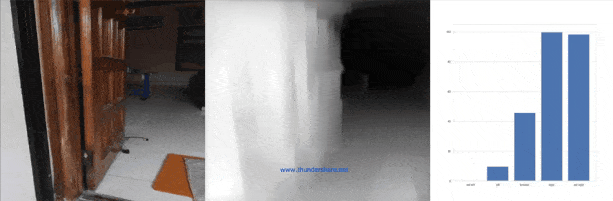

# Drishti: A Blind Navigation System

A Smart Blind Baseline System helps **blind people to sense their environment** by estimating the *depth* in a real-time image and guide them for the next step direction (**2100 milli-radian  coverage in 3-5  splits**), leveraging the power of End-to-end (**E2E**) learning with mathematical algorithms.

*E2E learning refers to training a possibly complex learning system represented by a single model (specifically a **Deep Neural Network**) that represents the complete target system, bypassing the intermediate layers or machine usually present in traditional the pipeline i.e uv sensor, depth sensor, etc*.

## Requirements
* This code is tested with `Tensorflow 2.3`,  on a machine with a *NVIDIA GTX 1650ti* and 8GB+ RAM running on Windows 10.
* Other packages needed `PyAudio`, `Numpy`, `Open-cv`, `Matplotlib`, `PIL`.

## Evaluation

#### 1. Images

* Clone the Repository. Put the images (.jpg) in `images` folder in the directory.
* Run

        python depth.py -m nyu -i images -s 5
        
* Arguments
        
        -m: Model Name (1. {nyu: NYU Depth V2 }, 2. {kitti: KITTI})
        -i: Image folder to be evaluated ( default folder: images)
        -s: Final direction guide (3, 5)
            5- ['ext-left', 'left', 'forward', 'right', 'ext-right']
            3- ['left', 'forward', 'right']
            
* Results

#### 1. Videos

* Clone the Repository. Put the video in `videos` folder in the directory.
* Run

        python cam_depth.py -m nyu -v video.mp4 -s 5
        
* Arguments
        
        -m: Model Name (1. {nyu: NYU Depth V2 }, {kitti: KITTI})
        -i: video-file name under 'videos' folder to be evaluated (default folder: video.mp4)
        -s: Final direction guide (3, 5)
            ['ext-left', 'left', 'forward', 'right', 'ext-right']
            
* Results

#### 2. Audio

* Clone the Repository. Put the video in `videos` folder in the directory.
* Run

        python cam_audio.py -m nyu -v video.mp4
        
* Arguments
        
        -m: Model Name (1. {nyu: NYU Depth V2 }, {kitti: KITTI})
        -i: video-file name under 'videos' folder to be evaluated (default folder: video.mp4)
            
* Results

Generation of **44.1kHZ Sample rate Stereo (Stereophonic sound for 2 independent earphone output) wave file** for corresponding next step direction`['left', 'forward', 'right']` for given video input.

**Derived an <a href="https://github.com/Adk2001tech/Drishti-A-Blind-Navigation-System/blob/main/results/Audio_depth.wav">Audio</a> file for the <a href="https://github.com/Adk2001tech/Drishti-A-Blind-Navigation-System/blob/main/videos/video.mp4">Video</a> sample.**

## Pre-trained Models

Download **Depth Estimating** pre-trained models (`models/model.h5`)

1. <a href="https://s3-eu-west-1.amazonaws.com/densedepth/nyu.h5">**NYU Depth V2**</a>
2. <a href="https://s3-eu-west-1.amazonaws.com/densedepth/kitti.h5">**KITTI**</a>
        
        
